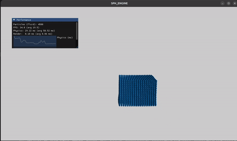

# SPH_ENGINE

Solveur de fluides SPH (Smoothed Particle Hydrodynamics) en C++, avec rendu OpenGL temps
réel via `_engine`, mon moteur de rendu réutilisable.

## Le projet

Simulation d'une rupture de barrage (dam-break) : un volume d'eau confiné est relâché et
s'écoule sous l'effet de la gravité, avec collisions sur les parois du domaine. Le solveur
physique (noyau de lissage, calcul de densité/pression, viscosité, intégration temporelle)
tourne sur CPU ; les positions des particules sont ensuite transmises au moteur de rendu, qui
les affiche en instancing GPU pour tenir le temps réel même avec plusieurs milliers de
particules.

Un panneau de performance (ImGui) affiche en direct le temps passé dans le calcul physique et
dans le rendu, image par image.

## Origine

Ce projet est né comme solveur autonome avec son propre code de rendu OpenGL, avant d'être
migré pour consommer `_engine` : la couche physique (calcul SPH) n'a pas changé une seule
ligne dans cette migration, seule la couche de rendu a été remplacée.

## Build

```bash
make          # compile dans build/, produit ./sph_engine
make run      # compile puis lance avec inputs/fluid.json
make clean    # supprime build/ et le binaire
```

## Dépendances

Eigen, GLFW, GLEW, GLM, jsoncpp. Dear ImGui est vendoré dans `engine/third_party/`.

## Démo


